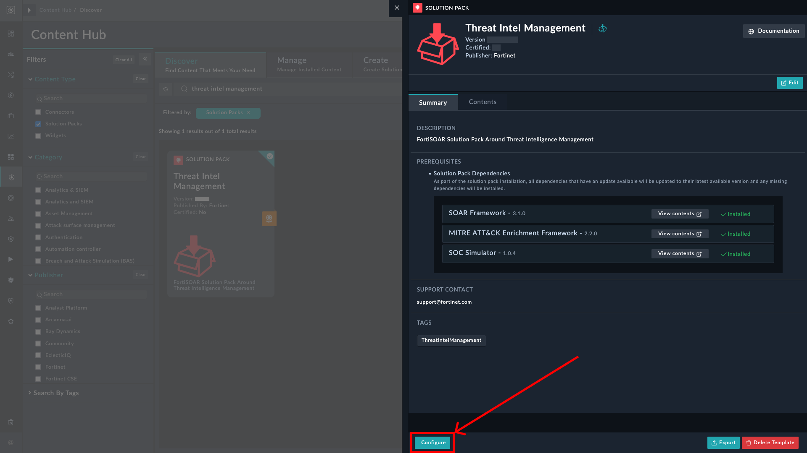
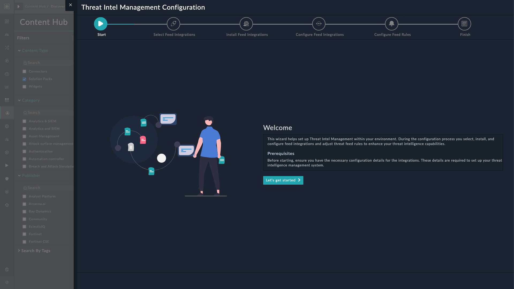
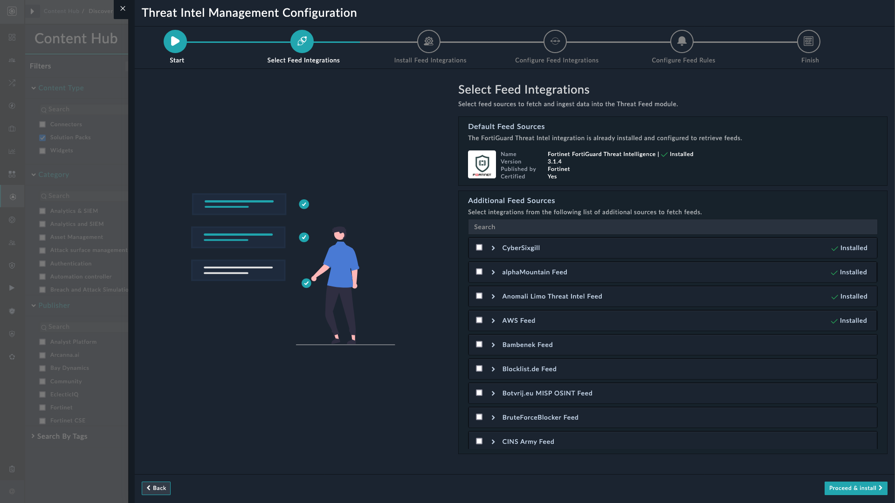
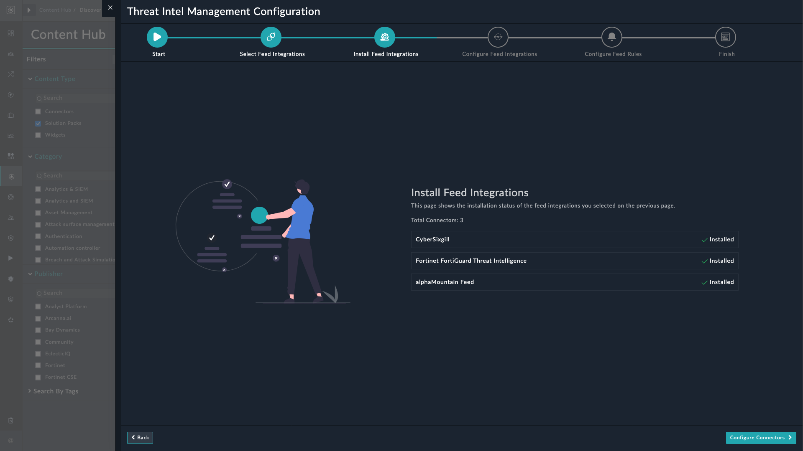
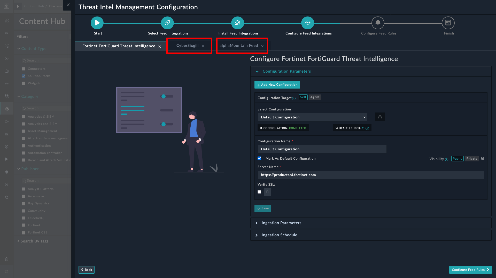
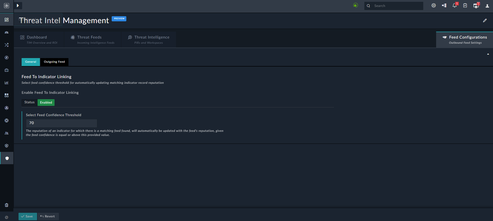

| [Home](../README.md) |
|----------------------|

# Installation

1. To install a solution pack, click **Content Hub** > **Discover**.
2. From the list of solution pack that appears, search for **Threat Intel Management**.
3. Click the **Threat Intel Management** solution pack card.
4. Click the **Install** button on the lower part of the screen to begin installation.

## Prerequisites

Threat Intel Management (TIM) Solution Pack requires the following solution packs to be pre-installed:

| Solution Pack Name                | Version          | Purpose                                                  |
|:----------------------------------|:-----------------|:---------------------------------------------------------|
| SOAR Framework                    | v2.1.1 and later | Required for Incident Response modules                   |
| MITRE ATT&CK Enrichment Framework | v2.2.0 and later | Required for Mitre Att&ck modules                        |
| SOC Simulator                     | v1.0.2 and later | Required for scenario module and SOC Simulator Connector |

# Configuration

For optimal performance of **Threat Intel Management** solution pack, you can install and configure:

- The FortiRecon ACI connector with its ingestion set up to ensure ingestion of FortiRecon ACI data in threat mitigation environment.
	- To configure and use the FortiRecon ACI connector as a source of Adversary Centric Intelligence(ACI) information, refer to [Configuring FortiRecon ACI](https://docs.fortinet.com/fortisoar/connectors/fortirecon-aci).

- The Exchange connector with email ingestion setup to ensure regular ingestion of threat feeds from email attachments.
	- To configure and use the Exchange connector, refer to [Configuring Exchange](https://docs.fortinet.com/fortisoar/connectors/exchange).

## Setup Threat Intel Management on FortiSOAR

The option to launch the Threat Intel Management Configuration Wizard appears on the Threat Intel Management solution pack's content hub page.

1. Click the **Configure** button to view the welcome screen of the wizard.

2. Click the **Let's get started** button to proceed.

### Selecting Feed Sources

This page of the Threat Intel Management configuration wizard helps select integrations from where to fetch threat intel feeds.

- The **Fortinet FortiGuard Threat Intelligence** connector is installed with the solution pack and is listed under **Default Feed Sources**.

- Other installed connectors, capable of fetching threat intel feeds, are listed under **Additional Feed Sources**.

	- Additional connectors, if installed, are marked as ** Installed**. Scroll the pane to view other connectors capable of fetching threat feeds.
	- Expand each listed connector to view its *Version*, *Publisher*, and if the connector is *Certified* by Fortinet.
	- Select the connectors to mark them for installation.
	- Once selected, click the button **Proceed & Install** to begin installation of selected connectors.

## Installing Feed Sources

This page of the Threat Intel Management configuration wizard displays the installation status of the connectors selected for installation in the *Select Feed Integrations* screen.

Click the **Configure Connectors** button to proceed.

## Configuring Feed Sources

This page of the Threat Intel Management configuration wizard helps configure feed integrations selected in *Select Feed Integrations* page and installed in *Install Feed Integrations* page.

- **Fortinet FortiGuard Threat Intelligence** is already configured for use out-of-the-box.

	-  **Ingestion Parameters**
		- **Confidence**: Specify the confidence score to assign to the ingested feeds.
		- **Reputation**: Select the reputation to assign to the ingested feeds.
		- **TLP**: Select the TLP to assign to the ingested feeds.
		- **Expiry**: Specify the age of the feeds in days.

	- **Ingestion Schedule**
		- On the Scheduling screen, from the **Do you want to schedule the ingestion?** drop-down list, select **Yes**.
		- Specify the `Cron` expression for the schedule. For example, if you want to pull data every 5 minutes, click **Every X Minute**, and in the **minute** box enter `*/5`. This means that the feeds are pulled and ingested every 5 minutes.

- Similarly, configure and specify parameters for each *installed* feed integration by clicking their respective tabs.

> [!NOTE]
> The ingestion parameters and ingestion schedule becomes available only when the configuration health check completes.

## Configuring Feed Rules

You can configure the following feed rules to manage threat intelligence feeds from various sources:

- Linking Threat Feeds to Indicators
- Ingesting Unstructured Threat Feeds

### Linking Threat Feeds to Indicators

Enable this rule and specify a feed confidence threshold to automatically update the matching indicator record reputation. This rule updates the reputation of an indicator that matches a feed with the reputation of the feed. The indicator is updated only when the confidence of the feed is equal to or more than the value specified in the **Confidence Threshold** field (70% in our example):

### Ingesting Unstructured Threat Feeds

Enable this rule to ingest unstructured threat feeds from file sources and email communications. This rule extracts critical threat feeds from unstructured data sources and automatically ingests it into the Threat Feeds module.

Once enabled, you can further fine-tune the rule by defining the following parameters:

- **Ingest Threat Feeds from Files**: Select to ingest unstructured threat feeds by uploading a file. Supported file formats are `csv`, `txt`, `pdf`, `eml`, `json`, and `xlsx`. Refer to the section [Importing Feeds from Files](./usage.md#importing-feeds-from-files) under *Usage* for more information.
 
- **Ingest Threat Feeds from Email Attachments**: Select to ingest unstructured threat feeds from email attachments.
	- **Email Client**: Select an email server from which to ingest emails. Currently, only *Exchange* is supported.
	- **Email Folder** : Select the mailbox folder, containing threat feed attachments.

> [!Note]
> Attachments of only unread emails are ingested.
 
- **Ingestion Parameters**
	- **Confidence**: Specify the confidence score to assign to the ingested unstructured threat feeds.
	- **Reputation**: Select the reputation to assign to the ingested unstructured threat feeds.
	- **TLP**: Select the TLP to assign to the ingested unstructured threat feeds.
	- **Maximum Age (in days)**: Specify the age of the ingested unstructured threat feeds, in days.
	- **Source**: Specify a value to be updated as *Source* for all ingested unstructured threat feeds.
	- **Tags**: Specify comma-separated values to be assigned as tags to the ingested unstructured threat feeds.

- **Email Ingestion Schedule**: Specify the frequency at which unstructured threat feeds are ingested from emails. This schedule will then automatically run at the specified frequency to ingest unstructured threat feeds. For example, if you want to ingest emails every 5 minutes, click **Every X Minute**, and in the **minute** box enter `*/5`. This means that emails are ingested every 5 minutes.
	- **Timezone**: Select a timezone in which to export the report. Default is *`UTC`*.

- Click the button **Save** to save the changes.

<!-- - **Block Threat Feeds Automatically**: Select this option to automatically block threat feeds immediately after they are ingested in the Threat Feeds module. Clear this option to manually block threat feeds.

- **Enable Threat Feed Ingestion Notifications**: Select to send notification emails when feeds are blocked on firewall. Specify comma-separated email addresses authorized to receive notifications when unstructured threat feeds are ingested.

- Click the button **Save Threat Feed Rules** to save and apply the changes made to the threat feed rules. -->

# Next Steps

| [Usage](./usage.md) | [Contents](./contents.md) |
|---------------------|---------------------------|