| [Home](../README.md) |
|----------------------|

# Usage

FortiSOAR's new **Threat Intel Management** Solution Pack brings Security Orchestration and Automated Response (SOAR) and Threat Intel Management (TIM) worlds closer by introducing advanced Threat Intel Management capabilities within the SOAR platform. The following video demonstrates how this integration greatly simplifies investigations by bringing in contextual threat intel.

| [](https://www.youtube.com/watch?v=vTvtHQxniVU) |
|:--------------------------------------------------------------------------------------------------------:|
|             [FortiSOAR Threat Intel Management](https://www.youtube.com/watch?v=vTvtHQxniVU)             |

## Threat Feed Management and FortiGuard Integration

Using comprehensive, ingestion-friendly feed integrations for multiple paid and open-source third-party feeds (available in FortiSOAR Content Hub), threat intelligence teams can now ingest varied feed data and manage them in a normalized, single pane of glass using the 'Threat Feeds' Module. The solution provides multiple ways to manage this volume of data by parameters such as feed and source confidence, TLP, severity, Expiry/Age, etc. Additionally, the solution helps create feed datasets to filter and group relevant feeds for use in sharing, exporting, or eventually as useful data reference while creating contextual threat intelligence.

Another big value-added feature of the solution is its comprehensive integration with FortiGuard, Fortinet’s flagship threat intelligence source. As part of the FortiSOAR TIM Solution, you get unlimited lookups into the rich FortiGuard threat intelligence database and the ability to ingest its valuable daily threat intelligence feed. In the 'Preview' mode, you can ingest a maximum of 100 feeds daily.

## Collaborative Framework To Create & Consume Actionable Threat Intelligence

Both incident response teams and organization members in and outside the SOC (executives, stakeholders, management) can raise Priority Intelligence Requirement (PIR) requests that drive threat intelligence-gathering efforts. The process starts with any SOC member raising a PIR with "*I need more information around this area/problem/artifact/actor, etc.*", followed by the SOC/threat intel team setting up workspaces in the Framework. A workspace is a goal-driven canvas that allows teams to dive into different phases of the threat intelligence lifecycle (direction, data collection, processing, analysis, dissemination, and feedback) to curate and share the process outcome with the stakeholder who asked for information. Threat feeds and datasets, MITRE ATT&CK Framework’s rich actor (tactics, techniques, tools, etc.) information and integration fuel FortiSOAR's automation engine, and FortiSOAR's multi-dimensional correlation framework form a great combination of the right data sources and tools to start one’s research.

## Sharing Threat Intelligence

The ability to generate and share the threat intelligence report with stakeholders enables making research actionable. A feedback loop is incorporated into the process to ensure the research meets the expected outcomes and allows for a dialogue between the request initiator (PIR owner) and the research team to get close to the goal. 

Additionally, the solution allows sharing of threat feeds and datasets over standard STIX/TAXII protocols for getting them across to products that can benefit from these threat feeds and datasets. For example, you can set up a TAXII server in FortiSOAR to broadcast relevant malicious and high-confidence feed datasets to a SIEM product such as Fortinet FortiSIEM, which eventually uses them to enhance detection rules and lookup watchlists. These datasets could also be sent using different integrations to update specific watchlists in these products.

## Feed Relationship Indicators

The solution is intelligent to auto-link malicious feeds with good confidence (configurable) with an indicator in the product and, if asked for, also update the indicator reputation. Such built-in intelligent workflows enable the consumption of feed intelligence while also improving the quality of daily investigations. There are several other handles, configurations, and options provided to manage the relationship between indicators and feeds in terms of feed confidence, sightings, similarities, and other parameters.

## Flow of Threat Intelligence Management

Once the TIM solution pack is installed, you must configure your threat intelligence feeds connectors such as Fortinet FortiGuard Threat Intelligence, Anomali Limo Threat Intel Feed, Cisco Talos Feed, MITRE ATT&CK, etc. based on your requirements, and then start ingesting data from these sources. For information on how to configure feed connectors, see the connector documentation on the [FortiSOAR Connectors](https://docs.fortinet.com/fortisoar/connectors) page.

### Dashboards

Once you have configured data ingestion and are receiving feeds from various sources, navigate to the Dashboard page by clicking **Threat Intel Management** in the left navigation.


The *Dashboard* provides you with insights into the ROI, effectiveness of ingestion, ingestion rates of feeds, how many observables were ingested, how many of the ingested observables got linked to indicators, and the relevance of the feed sources, etc. These metrics enable you to decide which threat feeds are worth monitoring and the performance of the various threat feeds.

The *Feed Ingested* dashboard component reflects statistics for Threat Intel Feeds ingested in the *Last 15 days*, while the *Ingestion Volume* component shows the active feeds.

### Threat Feed Management

Using a wide variety of feed integrations that are available on the **Content Hub**, you can seamlessly ingest feeds and get a normalized and aggregated view of the feeds on the **Threat Feeds** tab:  

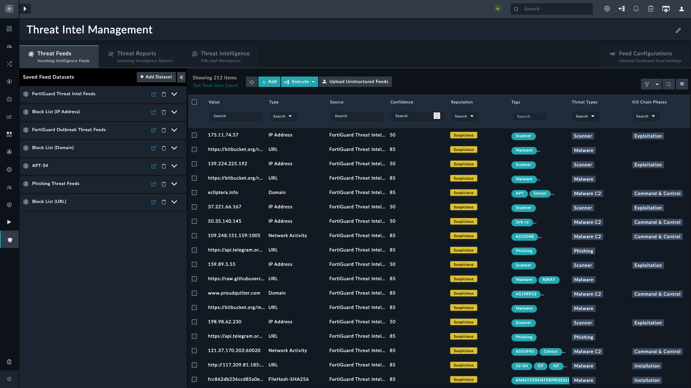

The Threat Feeds solution is well-architected to handle scale at one end and effectively manage feeds at the other. You can manage feeds with the help of parameters such as feed sources, their confidence, TLPs, expiry, etc.

The noise associated with the feeds is the main hurdle to managing feeds and deriving utility from the feeds. Therefore, as a first-level of filtration, the TIM solution allows you to create *Datasets*. To view datasets, click the **Manage Datasets** arrow to view the created datasets or to add new datasets:  

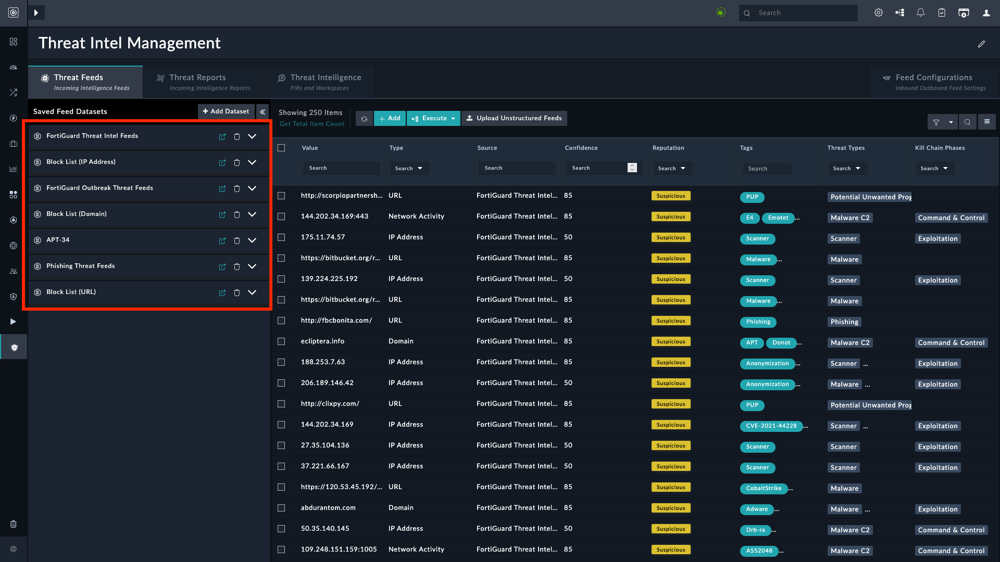

For example, let's look at the COVID-related feeds dataset. In the COVID-related feeds, you can apply the first-level filtration by choosing some tags that are of interest and also specifying a confidence level of over 60. This filtration would eliminate those feeds that do not contain the specified tag and whose confidence level is lower than 60, thereby helping to eliminate some of the noise:


Similarly, you can create multiple datasets based on your goals or filtration requirements, and use them while you are creating actionable threat intelligence.

With **FortiSOAR 7.2.2 and later**, the **Threat Intel Feeds** module better tracks the date and time at which the feeds were ingested or updated into the FortiSOAR instance.

Enabling the **Trackable** checkbox makes the following fields available in the feed management grid:
- Created On
- Created By
- Modified On
- Modified By

The time of the creation of feeds at intel source appears under the field *Created at Source*. Similarly, *Modified at Source* shows the time of modification at the intel source.

### Threat Intelligence Workflow 

The **Threat Intelligence** tab is the cornerstone of the TIM solution, as threat feeds alone can often prove to be a burden on the threat intelligence team and analysts when there is no clear picture of what to consume and what to leave. On the Threat Intelligence tab, you can create and consume actionable and contextual threat intelligence:  


A quick example of creating a threat intelligence workflow can be a management request, to the threat intelligence team, for information on a particular threat actor group such as APT 34 in the Middle East and the Telecom sector. After receiving this request, the threat intelligence team can create a *Workspace* in the **Recent TIM Workspaces** section as follows:

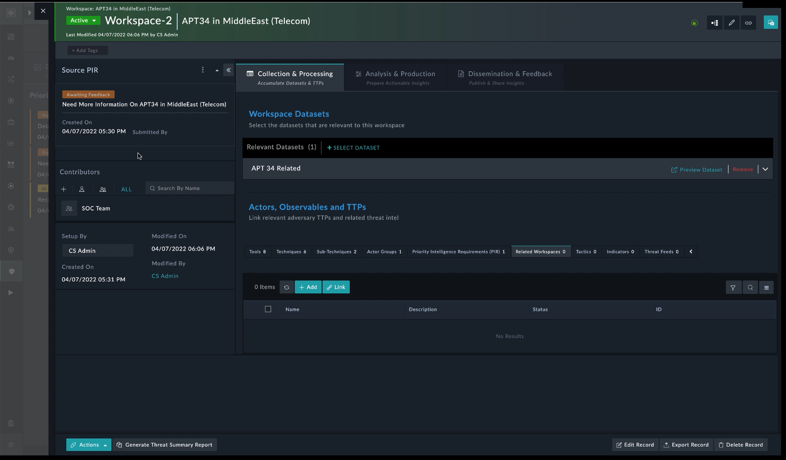

As you can see, the threat intelligence team has defined a workspace for APT in the Middle East (Telecom). The *Workspace* contains a **Source PIR** section in which the PIR automatically links and the threat intelligence team can add more contributors, allowing for comprehensive research. Also, the workspace is split into various phases aligned to the Threat Intelligence Lifecycle, where the first stage is collecting and processing data, followed by analyzing the data, and then finally sharing the actionable insights with the stakeholders using reports, etc.

On the **Collection & Processing** tab, you can use the datasets that you have created or you can add new datasets in the **Workspace Datasets** section. You can add or link a variety of correlation feeds from the MITRE ATT&CK intelligence framework around its techniques, sub-techniques, tools, etc., or can be associated with vulnerabilities, indicators, notes, etc.

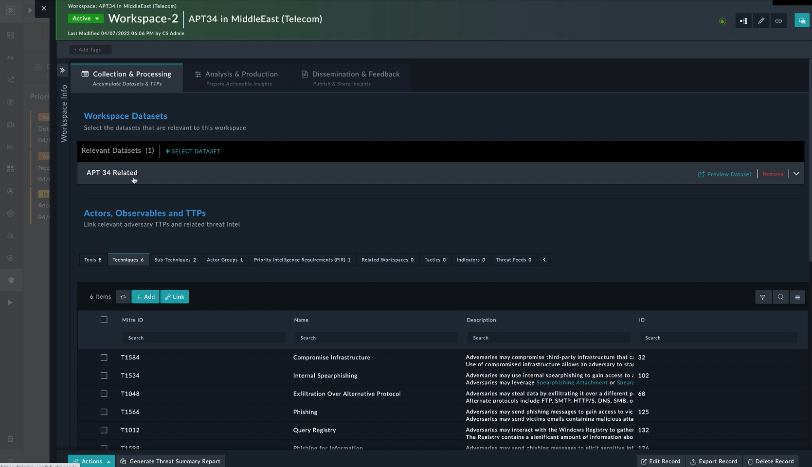

After you have collected the data, you can start analyzing the data on the **Analysis & Production** tab, where you look at how various components are correlated, etc. You can also jot down your findings in **Notes**:

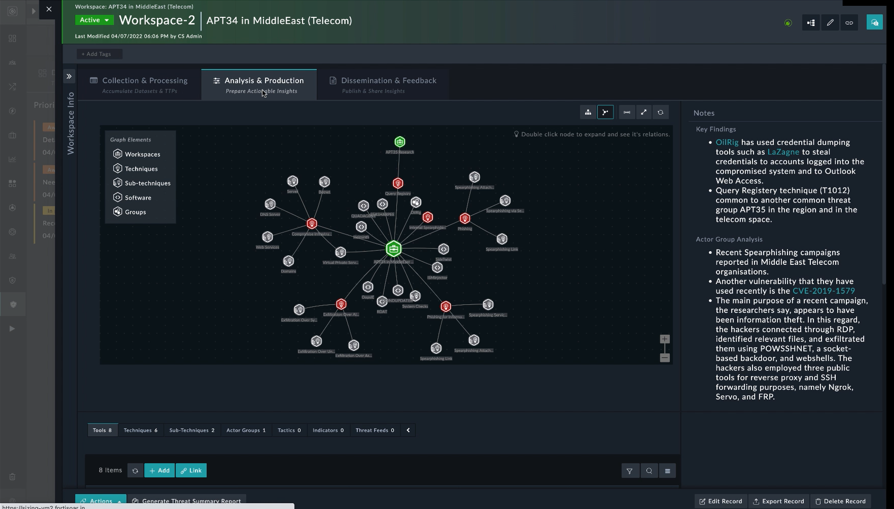

If you have a wider team to analyze with, you also have **Task Management** available, using which you can assign tasks to various team members.

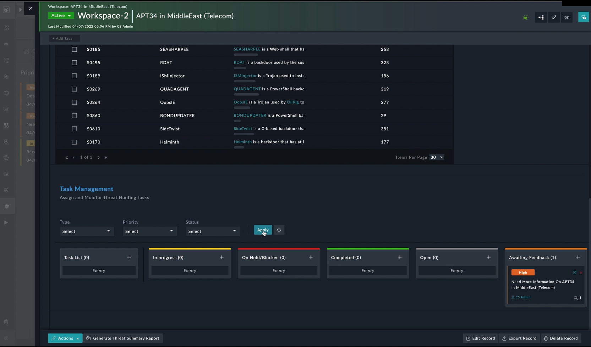

Once you are done with your analysis, you move on to the **Dissemination & Feedback** tab, where you can share your findings with a larger audience.

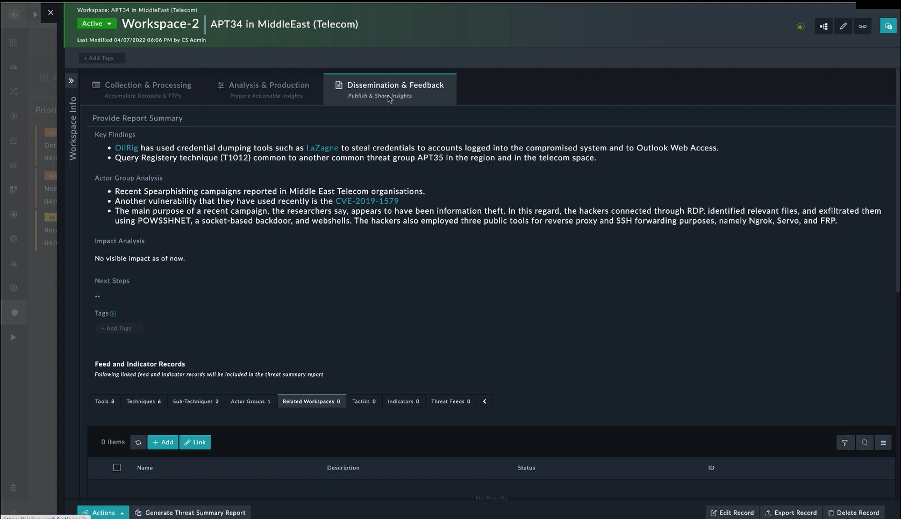

You can generate a threat summary report of your findings by clicking the **Generate Threat Summary Report** button.


In the Generate Threat Summary Report popup, you can choose various options, such as adding a comment to the workspace and PIR with the report attached for feedback, updating the PIR task status to 'Awaiting Feedback', and you can also assign the task back to the person who raised the request for feedback. Clicking **Generate Threat Intel Summary Report** generates the report and sends it to the team members. This also starts the feedback loop, which if actionable, leads to improvement in the detection rules or other areas of improvement.

There are other ways in which threat intelligence teams interact with workspaces. For example, there can be a request to the threat intelligence team from the management to monitor all alerts that contain COVID correlations and provide threat intelligence insights related to these correlations. Now, if the team receives the following *Phishing* alert that contains COVID correlations:


Now, for this phishing alert, the team needs to get more intelligence around the URL in the *Covid* correlation that does not contain reputation information (No Reputation Available) from the standard enrichment sources. So then, you can select that correlation and click **Execute** and choose the **Raise Priority Intelligence Requirement Request (PIR)** playbook:


Clicking  **Raise Priority Intelligence Requirement Request (PIR)**  displays a  **Raise Priority Intelligence Requirement Request (PIR)**  popup, in which you can specify the details of the PIR and then click **Submit PIR Request To Threat Intel Team**. This in turn submits the PIR to the threat intelligence team and they create the required workspace such as 'Investigatecovidreporting.com'. Next, the threat intelligence team can start investigating the URL, finding related IPs, running whois analysis, etc., and then add all the relevant items and send this information back to the *Firewall* team, which starts the feedback loop and dialog between teams, making detection and prevention more effective.

### Feed Configurations
On the **Feed Configurations** > **General** tab, you can configure the feed confidence threshold to automatically update the matching indicator record reputation. In this case, the reputation of an indicator that has a matching feed gets automatically updated with the reputation of the feed, provided the confidence of the feed is equal or above to the value specified in the Selected Feed Confidence Threshold field (70% in our example):  


The **Outgoing Feed** tab allows you to configure standard ways to share threat feed data. Under **Enable TAXII Server**, click the button to enable the TAXII server so that any TAXII client can subscribe to the collection and receive feeds.


As soon as you enable the TAXII server, the following details appear under **TAXII Server Details**:

**Server address**: Contains a TAXII server address for the clients to connect, and eventually process.

**Authentication method**: The authentication method that clients may use to connect. They may use the URL for authentication, as demonstrated in the example.

**Available Endpoints**: There are 4 endpoints available. Append these to the end of a TAXII server address to get the mentioned result:

| Path                               | Purpose                                 |
|:-----------------------------------|:----------------------------------------|
| `api/taxii/1/collections`          | list all available datasets             |
| `api/taxii/1/collections/`         | get details of any dataset              |
| `api/taxii/1/collections/objects`  | list threat feeds in a dataset          |
| `api/taxii/1/collections/objects/` | list details of a specific feed objects |

**Available Datasets**: The `Available Datasets` section, contains a list of all datasets of the Threat Intel Feeds module. You can click the **JSON** or **CSV** icons to export the threat feeds in the JSON format or the CSV format respectively. You can use the exported threat feeds for consumption in other use cases.

>**NOTE**: You need **FortiSOAR release 7.2.2 or later** to export the threat feeds in the CSV format.

Apart from this, you can also use standard ways to export a CSV file so that other tools can import and use the filtered threat intelligence data.

## Example - Export a CSV's Specific Fields to FortiGate

FortiGate accepts a list of indicators in CSV format. The CSV file must contain only the `value` field in the CSV file exported from FortiSOAR. The following steps help export a CSV file from FortiSOAR's Threat Intel Management module for importing in FortiGate.

### Create a Dataset

1. Navigate to **Threat Intel Management** from the FortiSOAR menu.
2. Select the tab **Threat Feeds**.
3. Click the button **+ Add Dataset**.

  

4. Enter the **Dataset Label** and **Filter Criteria**. For this example, we have considered only those domains, whose confidence score is greater than **85**.
5. Click **Save Dataset**.

  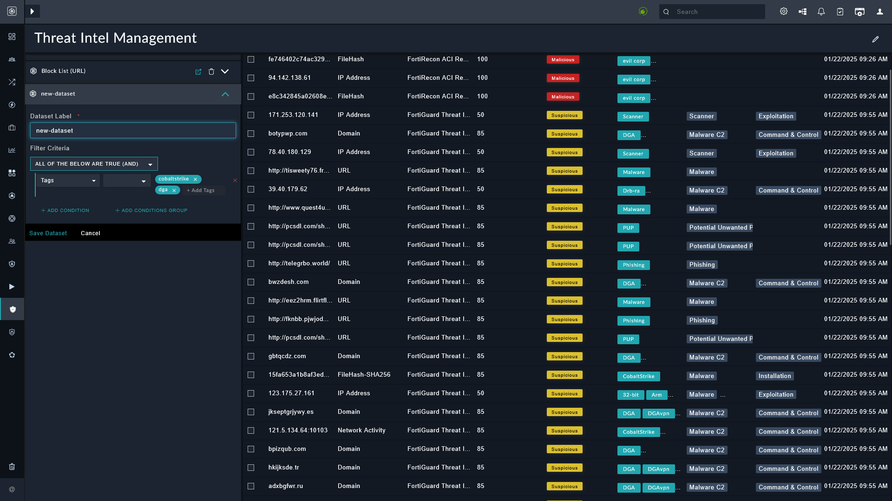

### Configure Feeds

1. Select the tab **Feed Configurations** on the upper-right part of the screen.
2. Under the **Feed Configurations** tab, select the tab **Outgoing Feed**.

  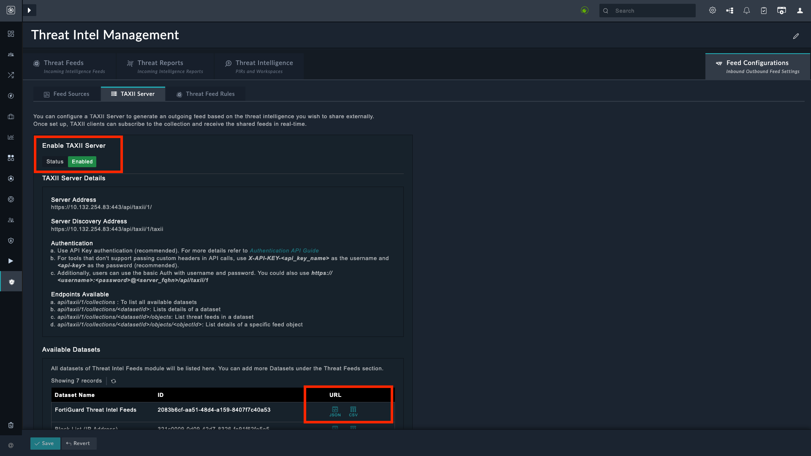

3. Set the **Status** to **Enabled**. (Highlighted `1`)
4. Click the CSV icon to copy the endpoint URL. The URL is of the following format

    ```
    https://<server-address>/api/taxii/1/collections/<collection-ID>/objects?$format=csv&$limit=1000
    ```
    The CSV obtained has multiple comma-separated fields like `confidence`, `validFrom`, `validUntil`, `lastSeen`, and `value`. FortiGate requires only the `value` field in a CSV format that can be obtained by appending `$__selectFields=value` to the URL.
    >**TIP**: To obtain multiple fields in a CSV format, separate the field with a comma. For example, appending `$__selectFields=value,confidence` to the URL returns the value (domains in our example) and their confidence score received from the Threat Feeds.

### Import the Feeds in FortiGate

1. Log in to FortiGate.
2. Navigate to **Security Fabric** > **External Connectors**.
3. Click the button **+ Create New**.

    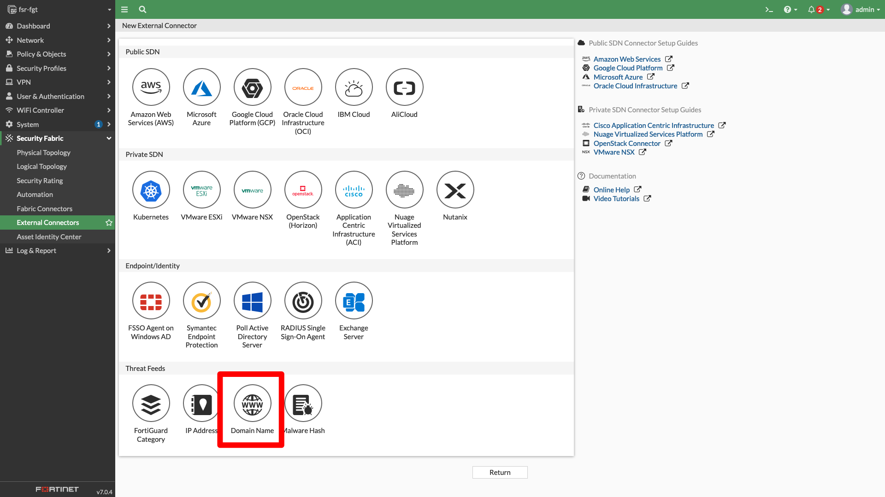

4. Scroll down to **Threat Feeds** and select **Domain Name**.
    
    >**NOTE**: When [creating a dataset](#create-a-dataset), we specified *Domain* as *Type*. Hence, we choose **Domain Name** in FortiGate.

    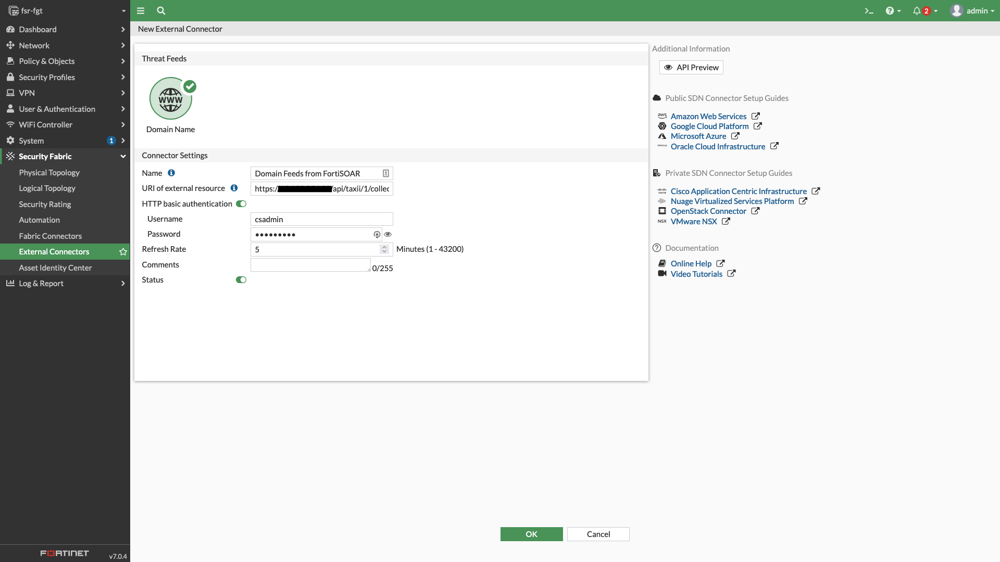

5. Enter the name of this connector.
6. Enter the endpoint URL that fetches only the value.
7. Enable **Basic Authentication** and enter FortiSOAR login credentials for the endpoint URL.
8. Enter a time interval in the **Refresh Rate** field to fetch feeds from the endpoint URL.
9. Enable the **Status** toggle.
10. Click **OK** to save the config.

### View Entries in FortiGate

1. Log in to FortiGate.
2. Navigate to **Security Fabric** > **External Connectors**.
3. Hover over the card you just created and select **View Entries**. It shows the domains that you have imported along with their validity.

With this, the domains retrieved from the Threat Intel Management feed is imported into FortiGate for it to initiate action. Similarly, we can use this example to get the list of IP addresses and URLs.
